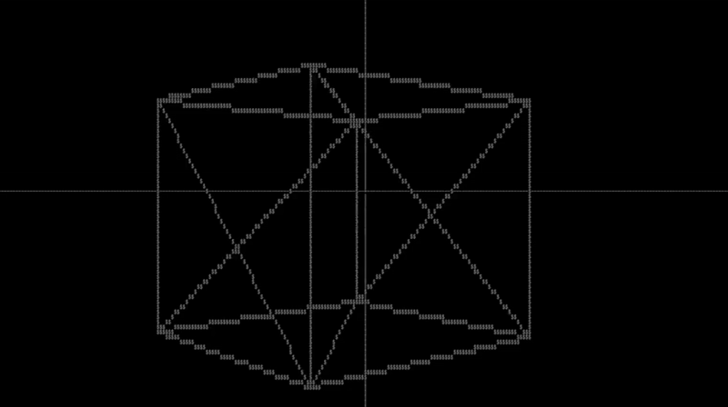

# Terminal 3D Render Engine

A lightweight **3D render engine** that runs directly in the terminal.

> **Disclaimer:** The code is currently quite messy, and I plan to refactor it soon! It also doesn't currently work on Linux.


<figure>
  
  <figcaption><em>Rotating Cube Example</em></figcaption>
</figure>

---

<figure>
  
  <figcaption><em>Rotating Dual Polyhedron Example</em></figcaption>
</figure>

---

## 🔧 Building & Running

This project uses **CMake** for cross-platform builds.

#### Build the project

```sh
cmake -B build -S .
```

#### Build the executable

```sh
cmake --build build
```

#### Build & Run

To build and run the project:

```sh
cmake --build build --target run
```

### 🐧 Linux

#### Build & Run

```sh
make -C build run
```

### 🪟 Windows

#### **Visual Studio**

[The first build command](#build-the-project) targets Visual Studio by default.
It generates a Visual Studio `.sln` project.

#### **MinGW (Alternative)**

To build with MinGW:

```powershell
cmake -B build -S . -G "MinGW Makefiles"
```

To build the executable:

```powershell
mingw32-make -C build
```

Run the engine:

```powershell
mingw32-make -C build run
```

Now you’re ready to experience 3D rendering in the terminal! 🚀
